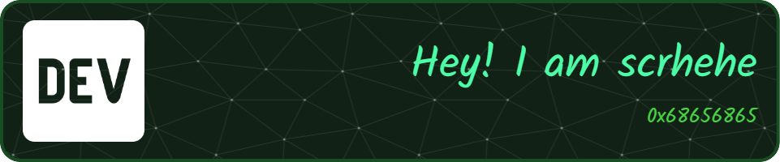

---

# 💫 About Me:
🔭 I’m currently working on scrhehe 👯 I’m looking to collaborate on scrhehe 🤝 I’m looking for help with scrhehe 🌱 I’m currently learning scrhehe 💬 Ask me about scrhehe ⚡ Fun fact scrhehe

## 🌐 Socials:
    

---

## 🛠️ My Favorite Tools and Technologies

> Technologies I’ve worked with and have a strong interest in — especially in cybersecurity, backend, and infrastructure

<table>  
  <tr>  
    <td align="center" width="96">  
       Python  
    </td>  
    <td align="center" width="96">  
       C++  
    </td>  
    <td align="center" width="96">  
       C#  
    </td>  
    <td align="center" width="96">  
       JavaScript  
    </td>  
    <td align="center" width="96">  
       ASP.NET  
    </td>  
    <td align="center" width="96">  
       Django  
    </td>  
    <td align="center" width="96">  
       Linux  
    </td>  
    <td align="center" width="96">  
       Docker  
    </td>  
    <td align="center" width="96">  
       Nginx  
    </td>  
  </tr>  

  <tr>  
    <td align="center" width="96">  
       Git  
    </td>  
    <td align="center" width="96">  
       GitHub  
    </td>  
    <td align="center" width="96">  
       GitLab  
    </td>  
    <td align="center" width="96">  
       Postman  
    </td>  
    <td align="center" width="96">  
       REST API  
    </td>  
    <td align="center" width="96">  
       Redis  
    </td>  
    <td align="center" width="96">  
       PostgreSQL  
    </td>  
    <td align="center" width="96">  
       RabbitMQ  
    </td>  
    <td align="center" width="96">  
       Pytest  
    </td>  
  </tr>  

  <tr>  
    <td align="center" width="96">  
       Sentry  
    </td>  
    <td align="center" width="96">  
       Celery  
    </td>  
    <td align="center" width="96">  
       Docusaurus  
    </td>  
    <td align="center" width="96">  
       Dart  
    </td>  
    <td align="center" width="96">  
       HTML  
    </td>  
    <td align="center" width="96">  
       CSS  
    </td>  
    <td align="center" width="96">  
       Bootstrap  
    </td>  
    <td align="center" width="96">  
       Tailwind  
    </td>  
    <td align="center" width="96">  
       JQuery  
    </td>  
  </tr>  
</table>

---

# 📊 GitHub Stats:
 
 

## 🏆 GitHub Trophies

### ✍️ Random Dev Quote

### 🔝 Top Contributed Repo

---

  ## 💰 You can help me by Donating
   

  
## ☕ Support

---

Crafted with 🔐 by 0x68656865 • © 2025
